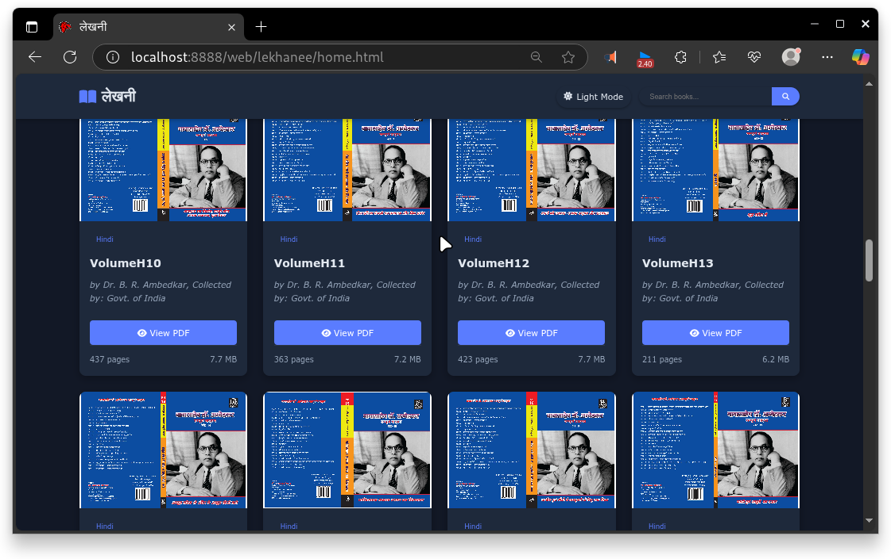
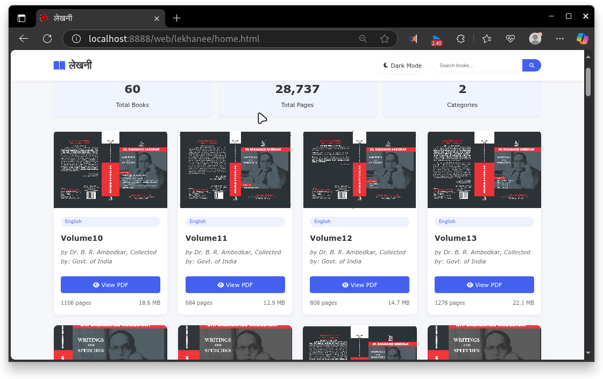
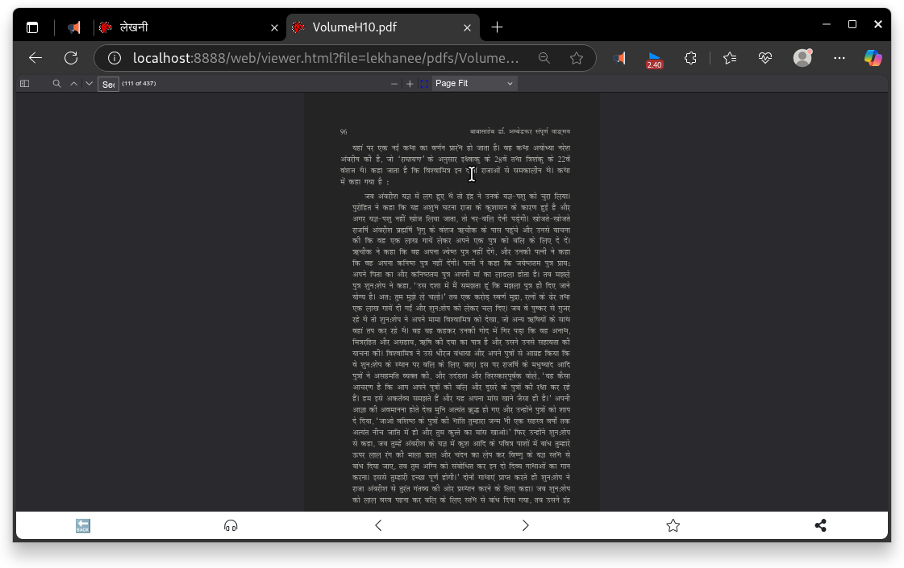

# 🪶 **Lekhanee**

**Lekhanee** — An **offline**, complete archive of **Dr. Babasaheb Ambedkar’s Writings and Speeches**, featuring a custom **Devanagari text renderer** for crisp, accessible reading — even on low-end devices and with no internet.

Designed especially for **Buddha Vihars**, libraries, and community spaces where **internet access is limited or absent**.

---

## ✨ **Key Features**

- 📚 **Complete Writings & Speeches** of Dr. Babasaheb Ambedkar — available **offline**.
- 🪷 **Custom Devanagari Renderer**  — for clear, beautiful Hindi/Marathi text.
- 🌙 **Dark & Light Modes** — comfortable reading day or night.
- 🖥️ **HTML-like Rendering** — modern and crisp in browsers.
- 🔊 **Optional TTS Integration** with [Vaaniy](https://github.com/borkarsachin97/vaaniy) — read text aloud in Hindi/English.
- 🧘‍♂️ **Minimal, mindful design** — focus on the words, not distractions.

---

## 📷 **Screenshots**

 - Dark Mode 
 
 
 - Light Mode
 
 
 - Custom Renderer
 

---

## ⚙️ **Requirements**

- **Node.js** and **npm** (Node Package Manager)
- **Gulp CLI** (`npm install -g gulp-cli`)
- A modern web browser

Everything else is **self-contained** — no internet needed once it’s installed.

---

## 📦 **Installation**

1️⃣ **Clone or download:**
```bash
git clone https://github.com/borkarsachin97/lekhanee.git
```

Or download as ZIP and extract it.

2️⃣ **Navigate into the folder:**

```bash
cd lekhanee
```

3️⃣ **Install Gulp CLI globally:**

```bash
npm install -g gulp-cli
```
4️⃣ **Install project dependencies:**

```bash
npm install
```

---

## 🚀 Run the Offline Server
1️⃣ **Start the virtual server:**

```bash
npx gulp server
```

2️⃣ **Open your browser and visit:**

```bash
http://localhost:8888/web/lekhanee/home.html
```

✅ **That’s it — you’re reading Babasaheb, completely offline!**

---

## 🔊 TTS Integration
Lekhanee works with **Vaaniy — an offline Piper-based TTS engine.**
You can:

 - Select any text.
 - Use Vaaniy’s shortcut to read it aloud instantly.

**Some manual tweaks may be needed — see the Vaaniy repo for details.**

---

## 📌 Use Case
 - ✅ Currently being used in Buddha Vihars to make Babasaheb’s speeches accessible where there’s no internet.
 - ✅ Tested by the developer in real conditions.
 - ✅ Lightweight, runs on basic hardware.

---

## 🧩 Current Status
- ✅ Core archive and renderer working offline
- ✅ Basic modes and custom fonts implemented
- 🚧 Advanced features (bookmarks, search, annotations) coming soon
- ✅ Designed for Buddha Vihars & libraries without internet

---

📜 License
```
See the LICENSE file for license details.
Lekhanee is released under the Apache License 2.0.
```

---

## 🪷 Namo Buddhay!
## 🪷 Jai Bhim!

